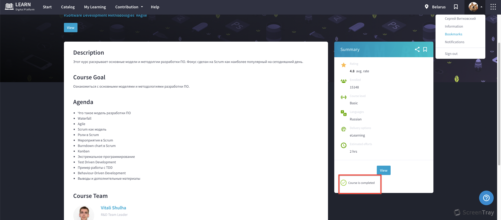

# Software Development Methodologies

## Waterfall
### Принципы
1. **Анализ требований проекта.**  
Определяются программные требования для информационной предметной области системы.

2. **Проектирование.**  
Разрабатывается и формулируется логически последовательная техническая характеристика программной системы. Детализация системы.
3. **Реализация ПО.**  
Воплощение полноценного проекта.

4. **Тестирование продукта.**  
Тестовая эксплуатация продукта

5. **Интеграция системы.**  
Включает установку и официальную приёмку 
продукта

6. **Поддержка.**  
Предоставление технической помощи по продукту после запуска а коммерческую эксплуатацию.

### Минусы

* Watrefall проект должен постоянно иметь актуальную документацию. Обязательная актуализация проектной документации. Избыточная документация
* Очень не гибкая методологии
* Может создать ошибочное впечатление о работе над проектом (например фраза «45% выполнено» не несёт за собой никакой полезной информации, а является всего лишь инструментов для менеджера проекта)
* У Заказчика нет возможности ознакомиться с системой заранее и даже с «Пилотом» системы
* У Пользователя нет возможности привыкать к продукту постепенно
* Все требования должны быть известны в начале жизненного цикла проекта
* Возникает необходимость в жёстком управлении и регулярном контроле, иначе проект быстро выйдет из графиков
* Отсутствует возможность учесть переделку, весь проект делается за один раз

### Плюсы
* Высокая прозрачность разработки и фаз проекта
* Чёткая последовательность
* Стабильность требований
* Строгий контроль менеджмента проекта
* Облегчает работу по составлению плана проекта и сбора команды проекта
* Хорошо определяет процедуру по контроля качества

---

## Agile
### Ценности
1. **Люди и взаимодействие важнее процессов и инструментов.**  
То, что общение и межличностные отношения важнее, чем строгие процессы — краеугольный камень Agile-управления проектами. Agile рекомендует персонализированный подход к управлению проектами, когда команды ориентируются на постоянное общение, а не на жестко распланированный выпуск обновлений.

2. **Работающий продукт важнее исчерпывающей документации.**  
Agile-команды не очень любят бумажную работу. Для управления данными, отчетами и обновлениями статуса они предпочитают использовать гибкие программные решения, а не традиционную документацию.

3. **Сотрудничество с заказчиком важнее согласования условий контракта.**  
Agile-команды любят сотрудничество — включая регулярные обновления и обратную связь о том, как продвигается проект, от клиентов и заинтересованных сторон. Чего Agile-команды не любят, так это долгих согласований объемных контрактов.

4. **Готовность к изменениям важнее следования первоначальному плану.**  
Эта ценность прежде всего характеризует Agile-управление проектами. Agile-команды чутко реагируют на изменения и успешно адаптируются к новым условиям и вызовам.

### Принципы
1. **Наивысшим приоритетом для нас является удовлетворение потребностей заказчика, благодаря регулярной и ранней поставке ценного программного обеспечения.**  
Главное для Agile-команды — удовлетворенность клиентов, поэтому они обязательно представляют результаты своей работы через регулярные промежутки времени, а не заставляют заказчиков ждать финального результата в конце проекта.

2. **Изменение требований приветствуется даже на поздних стадиях разработки. Agile-процессы позволяют использовать изменения для обеспечения конкурентного преимущества заказчика.**  
В этом их преимущество перед традиционными командами, которым обычно не так легко управлять изменениями.

3. **Работающий продукт следует выпускать как можно чаще, с периодичностью от двух недель до двух месяцев.**  
Вспомним, что Agile-команды ценят постоянное общение, а не жестко распланированный выпуск обновлений, которые могут слишком далеко отстоять друг от друга по времени, что может оказаться неприемлемым для клиентов. Команды Scrum, которые тоже работают по методологии Agile, разбивают свою работу на периоды от одной до четырех недель, известные, как спринты.

4. **На протяжении всего проекта разработчики и представители бизнеса должны ежедневно работать вместе.**  
Сотрудничество — краеугольный камень Agile, причем имеется в виду не только сотрудничество между членами команды, но и сотрудничество с заинтересованными сторонами, разработчиками, клиентами и другими партнерами.

5. **Над проектом должны работать мотивированные профессионалы. Чтобы работа была сделана, создайте им условия, обеспечьте поддержку — и полностью им доверьтесь.**
Agile-команды успешны, потому что в них работают только те люди, которые необходимы для проекта. Если участники Agile-команды получат поддержку, возможность работать вместе и инструменты, необходимые для работы, все остальное приложится.

6. **Непосредственное общение — наиболее практичный и эффективный способ обмена информацией как с самой командой, так и внутри команды.**
Все мы знаем, что главное в управлении проектами — личное сотрудничество. Этот принцип применим и во времена «новой нормы», при гибридных и удаленных моделях работы. Zoom и Teams — отличная альтернатива телефонным звонкам и электронной почте, а в ключевых точках проекта возможны и личные встречи команд.

7. **Работающий продукт — основной показатель прогресса.**
Смысл принципа, который называет работающий продукт основным показателем прогресса, в том, что главная цель команды всегда остается одна — предоставить клиенту как можно более высококачественный результат. Когда клиент доволен, это и есть главный показатель успеха проекта.

8. **Agile помогает наладить устойчивый процесс разработки. Инвесторы, разработчики и пользователи должны иметь возможность бесконечно поддерживать постоянный ритм Многие команды поначалу показывают бурный прогресс, который не получается сохранить до конца проекта.**

9. **Постоянное внимание к техническому совершенству и качеству проектирования повышает гибкость проекта**
Agile не работает по принципу «раз — и готово». Каждый новый проект — это возможность для инноваций, а не для повтора одних и тех же идей.

10. **Простота как искусство сократить до минимума лишнюю работу крайне необходима.**
Команды Agile не занимаются переусложнением — они просто соблюдают проектные требования и хорошо выполняют свою работу, а затем переходят к следующему проекту.

11. **Самые лучшие требования, архитектурные и технические решения рождаются у самоорганизующихся команд.**
Лучшие команды — это те команды, у которых есть лидер, предоставляющий им свободу самовыражения. Микроменеджмент редко делает команды лучше или продуктивнее, и Agile-команды — отличный пример того, чего можно добиться без микроменеджмента.

12. **Команда должна систематически анализировать возможные способы улучшения эффективности и соответственно корректировать стиль своей работы.**  
Непрерывное совершенствование — сама суть Agile, и регулярные проверки эффективности команды в целом могут помочь избавиться от вредных привычек и добиваться бо́льшего.
 
 --- 

## Scrum
### Scrum concept
1. **Журнал пожеланий проекта (Project backlog).**  
Журнал пожеланий проекта (бэклог проекта) содержит перечень требований к функциональности, упорядоченный по степени важности, и, соответственно, порядку реализации. Элементы этого журнала называются пользовательскими историями (user story) или элементами бэклога (backlog items). Бэклог проекта открыт для редактирования для всех участников процесса SCRUM. Ответственный за ведение бэклога проекта — владелец продукта SCRUM.

2.   **Журнал пожеланий спринта (Sprint backlog).**  
Журнал пожеланий спринта (бэклог спринта) — содержит функциональность, выбранную владельцем продукта из бэклога проекта. Все функции разбиты по задачам, каждая из которых оценивается командой SCRUM. На Sprint Planning Meeting методом покера планирования команда оценивает объём работы, который нужно выполнить для завершения спринта.

3. **Готоый продукт**  

### Scrum roles
* **Product Owner**  
Product Owner может быть некий руководитель или любой человек, относящийся к созданию списка задач. В целом, это может быть даже и не руководитель, но алгоритм его действия будет тогда в получении задания от руководителя в привычном для него виде и переработке этого задания в Product Backlog для Scrum. Это также важная и основная роль, ведь зачастую только Product Owner может остановить спринт.  

* **Scrum Master**  
От Scrum Master зависит успех работы команды от проекта к проекту. В классическом понимании менеджмента сравнивать его, на самом деле, не с кем. Scrum Master не может руководить, да-да, не может. Главная цель данной роли – улучшение работы команды посредством выявления существующих проблем и их решения, а также оптимизации работы, повышения комфорта и скорости.

* **Scrum Team**  
Команда в Scrum – это один единый организм. Команда должна чувствовать себя одним целым, одной ролью.

### Scrum events
* **Sprint Grooming**  
Во время подготовки к спринту или сеанса планирования спринта команда разработчиков просматривает элементы невыполненной работы и решает, сколько элементов будет разработано в течение следующего спринта, в зависимости от возможностей команды. 

* **Spring Planning**  
Планирование спринта — это событие в scrum, которое знаменует начало спринта. В ходе планирования определяется объем работы на спринт и способы выполнения этой работы. Планирование спринта осуществляется при содействии всей команды scrum.

* **Daily Scrum / Standup**  
Продолжительность: не более 15 минут.
Стендап нужен для того, чтобы быстро сообщить всем о ситуации в команде. Это не полноценная планерка. Атмосфера должна быть легкой и непринужденной, но не бессодержательной. Пусть каждый участник команды ответит на следующие вопросы.  
    > «Что мне удалось завершить вчера?»  

    > «Над чем я буду работать сегодня?»

    > «Есть ли препятствия в моей работе?»  

* **Sprint Rewiew**  
Обзора Спринта состоит в том, чтобы проверить результаты Спринта и определить будущие адаптации. Скрам-команда представляет результаты своей работы ключевым заинтересованным сторонам и обсуждает прогресс в достижении цели продукта

    Во время мероприятия Скрам-команда и заинтересованные стороны анализируют, что было сделано в Спринте и что изменилось в их среде.

* **Sprint Retrospective**  
Ретроспектива спринта — это повторяющееся собрание, которое проводится в конце спринта и используется для обсуждения того, что было хорошо в предыдущем цикле спринта и что можно улучшить в следующем спринте.

### Burndown chart
Данный график является основным средством для отслеживания выполненных задач в спринте или во всём проекте.

Синим на диаграмме сгорания отмечена идеальная линия выполнения задач, на которую и следует опираться.

Красным отмечена реальная история выполнения задач.

По шкале Y отмечают количество запланированных баллов (в данном случае), идеальные часы, количество задач и так далее.

По шкале X отмечают количество дней до окончания Sprint.

Как может показаться на первый взгляд, данная «Диаграмма сгорания задач» (Burndown Chart) служит всего лишь для самоконтроля и самоотчета, однако её использование может рассказать об очень многом.

[Очень хорошая статья по Burndown chart](https://ru.scrum-time.com/infobase/burndown-chart.php)

---

## Canban
Канбан помогает отслеживать процесс выполнения поставленных задач и распределять нагрузку между сотрудниками. Этот метод позволяет эффективно управлять работой команды и следить за сроками ее выполнения. Визуализация всех этапов позволяет каждому сотруднику быть в курсе продвижения процессов. Ознакомьтесь с основными принципами методологии канбан.

* **Визуализация процессов.**  
Важно, чтобы все поставленные задачи были добавлены в план. Их статус нужно обновлять по мере завершения каждого пройденного этапа. Такой подход позволяет шаг за шагом продвигаться вперед, следить за прогрессом и видеть задачи, решение которых требует большего времени и помощи.

* **Группировка задач.**  
Это делают на основании статусов. Самый простой способ — разделить задачи на три колонки: «Надо выполнить». «Выполняется»,« Выполнена». Такой подход предполагает перемещение поставленной задачи с одного этапа на другой и визуализирует рабочий процесс.

* **Внимание к незавершенным задачам.**  
Если задачи подвисают на каком-то этапе, следует разобраться в причинах, распределить ресурсы в случае необходимости или оказать нужную поддержку, чтобы завершить работу.

* **Постоянное совершенствование.**  
Контроль за соблюдением сроков выполнения задач и их перемещением с одного уровня на другой в системе канбан помогает видеть слабые места в процессах. Поэтому вы можете четко определить, где нужно уделить больше времени работе, где меньше, а в каких ситуациях стоит скорректировать нагрузку.

--- 

## Extreme Programming

[XP](https://worksection.com/blog/extreme-programming.html)

### Практики
1. Вся команда.
2. Игра в планирование
3. Частые релизы версий
4. Пользовательские тесты
5. Коллективное владение кодом
6. Непрерывная интеграция кода
7. Стандарты кодирования
8. Метафора системы
9. Устойчивый темп
10. Разработка, основанная на тестировании
11. Парное программирование
12. Простой дизайн
13. Рефакторинг

### Принципы
1. Простота
2. Коммуникация
3. Обратная связь
4. Смелость
5. Уважение

### Плюсы
* заказчик получает именно тот продукт, который ему нужен, даже если в начале разработки сам точно не представляет его конечный вид

* команда быстро вносит изменения в код и добавляет новую функциональность за счет простого дизайна кода, частого планирования и релизов

* код всегда работает за счет постоянного тестирования и непрерывной интеграции
* команда легко поддерживает код, т.к. он написан по единому стандарту и постоянно рефакторится

* быстрый темп разработки за счет парного программирования, отсутствия переработок, присутствия заказчика в команде

* высокое качество кода
* снижаются риски, связанные с разработкой, т.к. ответственность за проект распределяется равномерно и уход/приход члена команды не разрушит процесс
* затраты на разработку ниже, т.к. команда ориентирована на код, а не на документацию и собрания
### Минусы
* успех проекта зависит от вовлеченности заказчика, которой не так просто добиться

* трудно предугадать затраты времени на проект, т.к. в начале никто не знает полного списка требований

* успех XP сильно зависит от уровня программистов, методология работает только с senior специалистами

* регулярные встречи с программистами дорого обходятся заказчикам

* требует слишком сильных культурных изменений, чтобы не контролировать каждую задачу

* из-за недостатка структуры и документации не подходит для крупных проектов

* т.к. гибкие методологии функционально-ориентированные, нефункциональные требования к качеству продукта сложно описать в виде пользовательских историй.
